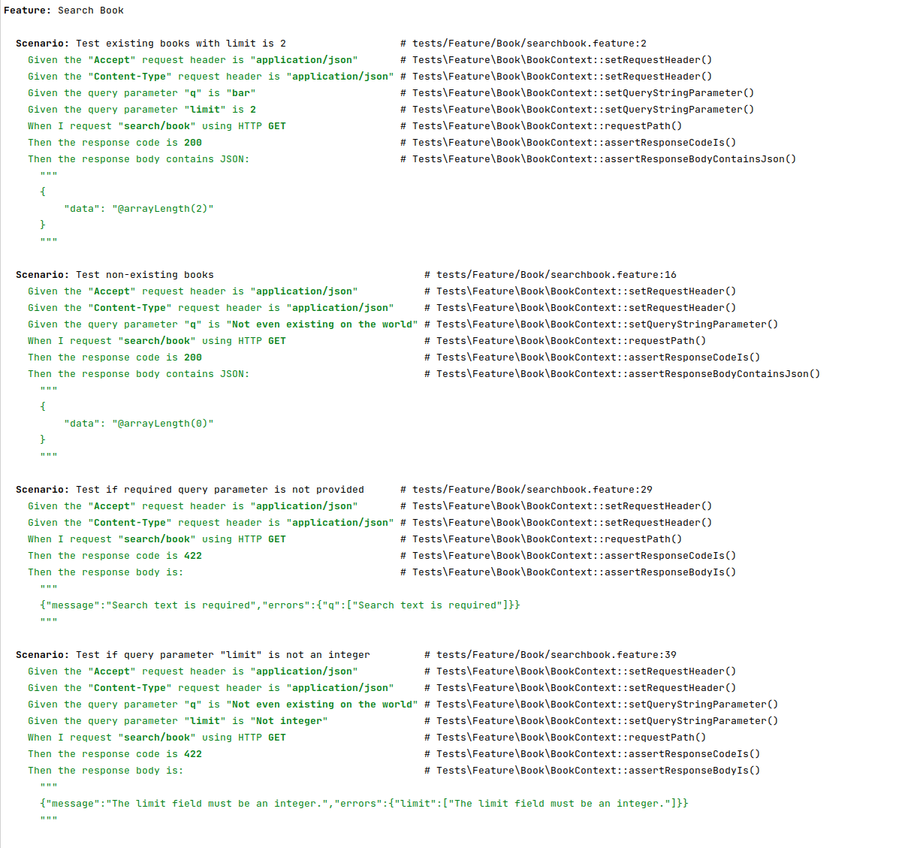

<p align="center"><a href="https://laravel.com" target="_blank"></a></p>

<p align="center">
    <a href="https://github.com/laravel/framework/actions"></a>
    <a href="https://packagist.org/packages/laravel/framework"></a>
    <a href="https://packagist.org/packages/laravel/framework"></a>
    <a href="https://packagist.org/packages/laravel/framework"></a>
</p>

## Book Reader API Assessment

Assume that you're being hired by BookReader company which is a book marketplace and has millions of books and audiobooks from publishers worldwide. Please develop an application with Laravel that provides a search API for end-users. It is essential for the business so their customers can find their books in a reasonable amount of time.

- The system should have a single api endpoint like <http://bookreaders.com.au/search/book?q={keyword}>
- The `keyword` can be a `title`, `summary`, `publisher`, or `authors`.
- The final JSON data model for a response should contain these values:

```json
{
    "id": 1234,
    "publisher": "Some Fancy Publisher",
    "title": "Mastering Something",
    "summary": "Long summary",
    "authors": [
        "Lovely Author One",
        "Lovely Author Two"
    ]
}
```

- The code should function properly and include tests to ensure its correctness.
- Dockerize your project and ensure that it works out of the box.
- Catch all edge cases and aim for the best run-time possible.
- You are free to use any architecture, design, and implementation method, but not external on-premise or cloud services.
- The code serves as our source of truth for assessing your expertise, so please showcase your best work.

Enjoy Coding :)


Laravel is accessible, powerful, and provides tools required for large, robust applications.
## Install
```
docker-compose up -d
docker-compose exec web composer install
docker-compose exec web php artisan key:generate
```

## Seeding data:
```
docker-compose exec web php artisan migrate
docker-compose exec web php artisan db:seed
```

## Run behavior test
```docker-compose exec web vendor/bin/behat```
## Run Lint
```docker-compose exec web vendor/bin/phpcs --standard=PSR12 app```

## Try the API:
http://localhost:8000/search/book?q=Asa&limit=1000

## Behat result first run:

